# Orchestration Saga 

In Orchestration-based Saga, a central orchestrator coordinates the entire transaction. The orchestrator is responsible for determining the order of operations and instructing each service to perform its actions.

In this Project there are 3 services:
1) Order Service : Orchestrator
2) Account Service : Participant
3) Inventory Service : Participant

## Working
- The Order Service acts as a orchestrator.
- It receives the order which includes accountId, ProductId , Quantity of the product.
- It then sends OrderEvent on Topic (Exchange) - order-exchange .
- OrderExchange is bound to two queues -product-queue and account-queue.
- Thus OrderEvent is published to both the queues product-queue and account-queue
- The inventory-service subscribes to product-queue and account-service subscribles to account-queue.
- Both process the OrderEvent independently and sends response to account-response queue.
- order-service subscribes to the account-response queue.
- If any of the inventory-service or account-service reports FAILED transaction, it re-sends OrderEvent with ORDER_CANCELLED status.
- On receiving the OrderEvent with ORDER_CANCELLED both the microservices initates rollback of the order.

## Steps:
- Maven Build all the 3 services.
- Run Maven Build of Order Service with -DskipTests=true or start Product Service and Account Service before running the maven build of Order Service.
- Start all the 3 services:
- Open Browser and create order

## Pre-requisites
1) RabbitMQ running locally or inside the container.
2) Create an exchange order-exchange
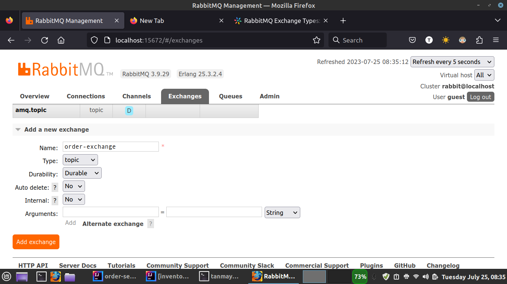
3) Create 3 queues
   1) product-queue 
   2) account-queue 
   3) order-queue

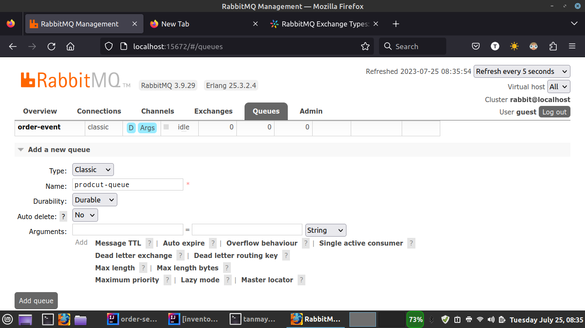
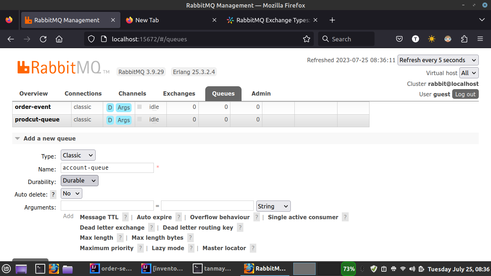

- Bind the exchange to product-queue and account-queue.
## Tests

There are 4 scenarios:

1) Happy Scenario : Both Inventory Service and Account Service were able to complete the transation.
`http://localhost:8082/createOrder?accountId=1&productId=1&quantity=5`

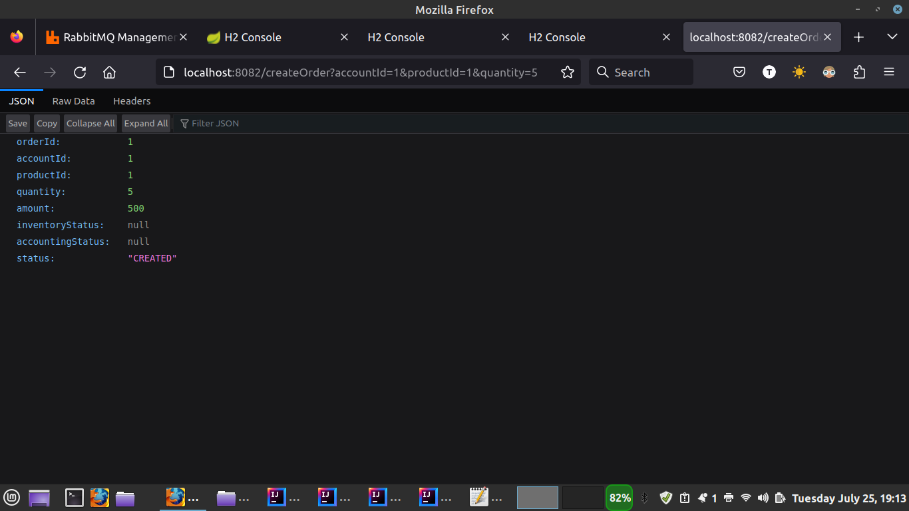
- The order is completed
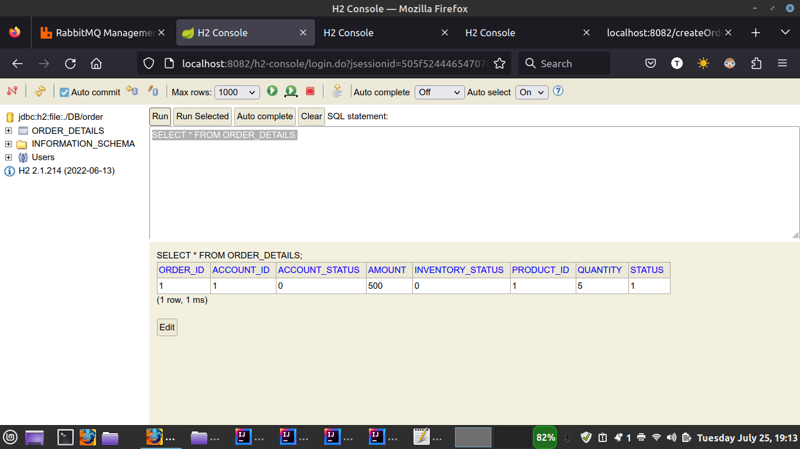
- The inventory service transaction is SUCCESSFUL.
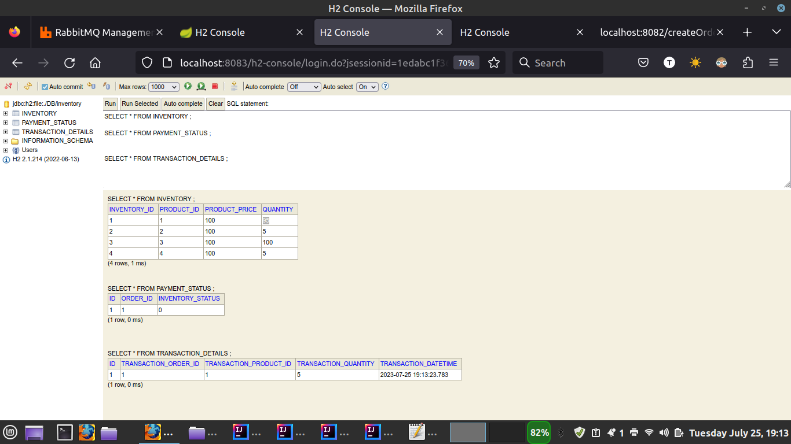
- The account service transaction is SUCCESSFUL.
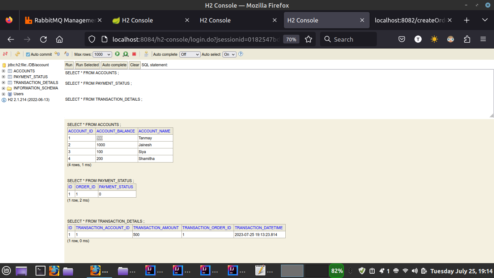
- Final order status

2) Failure Scenario 1 : Inventory Service reported less product in inventory than ordered value. Account Service has sufficient balance in the account.
`http://localhost:8082/createOrder?accountId=2&productId=2&quantity=8`

- The order is CANCELLED
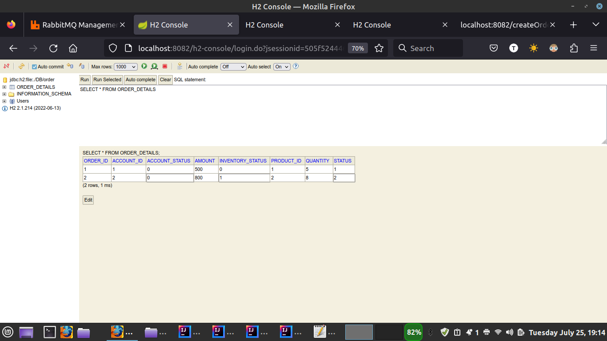
- The inventory service transaction is FAILED.
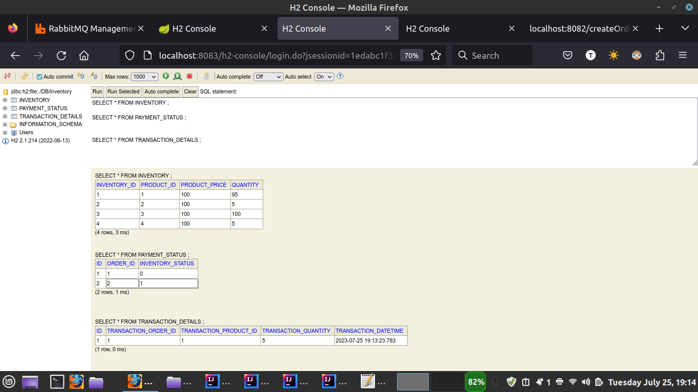
- The account service transaction is PAYMENT_ROLLEDBACK.

- Final order status is CANCELLED.
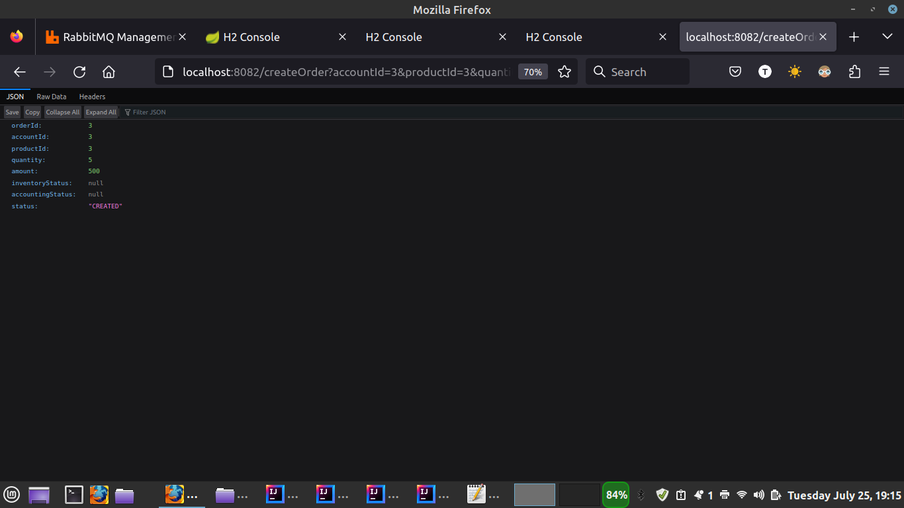

3) Failure Scenario 2 : Inventory Service reported sufficient product quantity in inventory than ordered value. Account Service reported in-sufficient balance in the account.
`http://localhost:8082/createOrder?accountId=3&productId=3&quantity=5`

- The order is CANCELLED
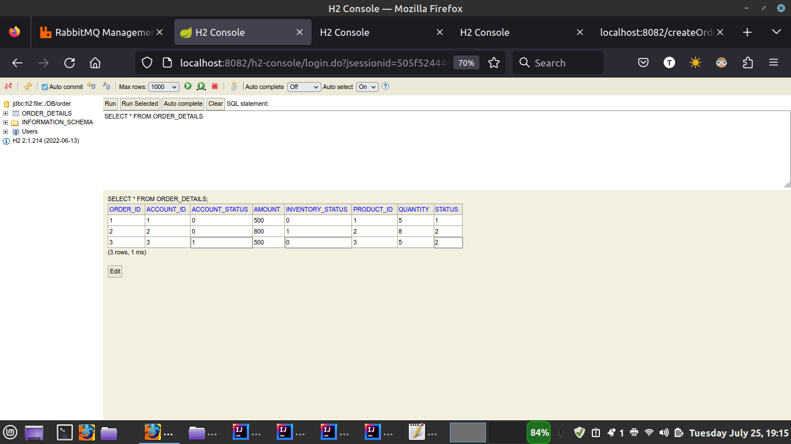
- The inventory service transaction is ROLLEDBACK.
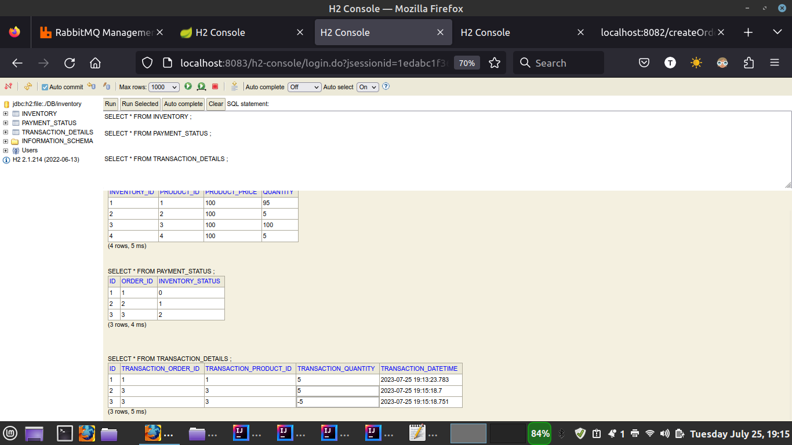
- The account service transaction is FAILED.
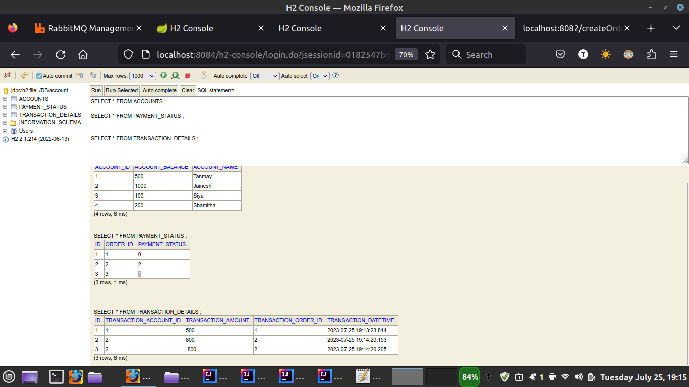
- Final order status is CANCELLED
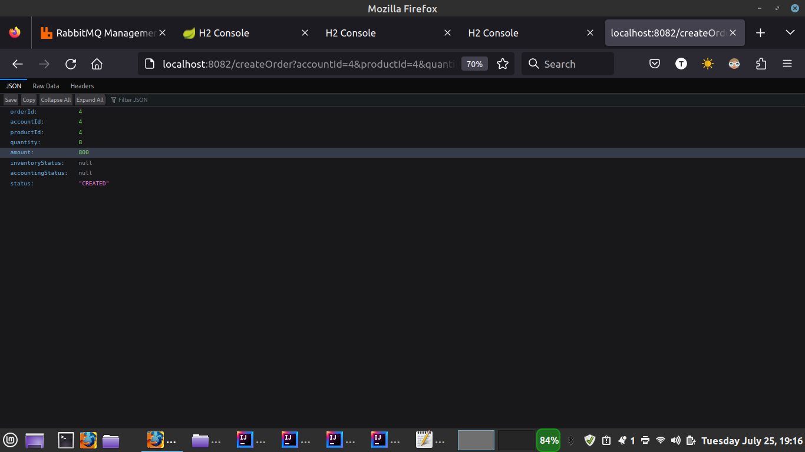

4) Failure Scenario 3 : Inventory Service reported in-sufficient product quantity in inventory than ordered value. Account Service reported in-sufficient balance in the account.
`http://localhost:8082/createOrder?accountId=4&productId=4&quantity=8`

- The order is CANCELLED.
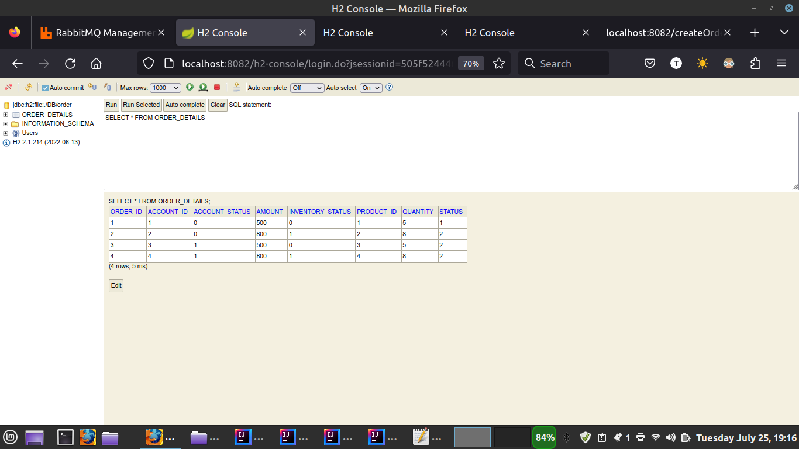
- The inventory service transaction is FAILED.

- The account service transaction is FAILED.
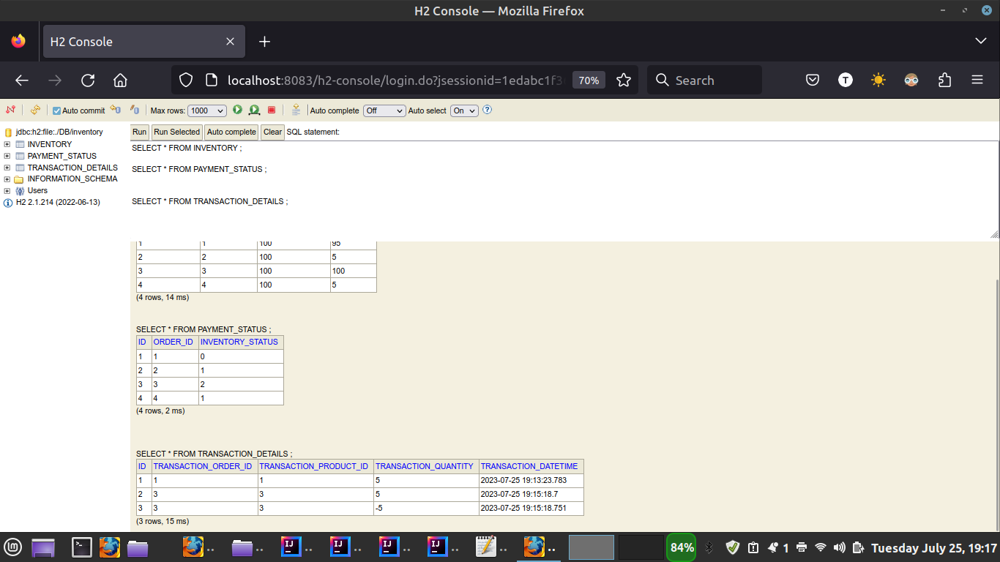
- Final order status is CANCELLED.

